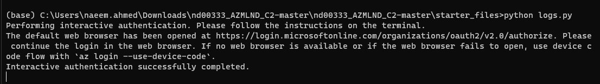

# Operationalizing Machine Learning

## Table of Content
* [Overview](#overview)
* [Architectural Diagram](#architectural-diagram)
* [Key Steps](#architectural-diagram)
    * [Authentication](#authentication)
    * [Automated ML Experiment](#automated-ml-experiment)
    * [Deploy the best model](#deploy-the-best-model)
    * [Enable logging](#enable-logging)
    * [Swagger Documentation](#swagger-documentation)
    * [Consume model endpoints](#consume-model-endpoints)
    * [Create and publish a pipeline](#create-and-publish-a-pipeline)
* [Screen Recordin](#screen-recording)
* [Standout Suggestions](#standout-suggestions)

## Overview
This project is part of the Udacity Azure ML Nanodegree.
In this project, we use Azure to configure a cloud-based machine learning production model, deploy it, and consume it. We also create, publish, and consume a pipeline.

## Architectural Diagram
These are the steps we followed in this project :

1. **Authentication** : In this step,we create a SP
2. **Automated ML Experiment** : In this step, we create an experiment using Automated ML, configure a compute cluster, and use that cluster to run the experiment.
3. **Deploy the best model** : Deploying the Best Model will allow us to interact with the HTTP API service and interact with the model by sending data over POST requests.
4. **Enable logging** : Logging helps monitor our deployed model. It helps us know the number of requests it gets, the time each request takes, etc.
5. **Swagger Documentation** : In this step, we consume the deployed model using Swagger.
6. **Consume model endpoints** : We interact with the endpoint using some test data to get inference.
7. **Create and publish a pipeline** : In this step, we automate this workflow by creating a pipeline with the Python SDK.

## Key Steps

### Authentication
Skipped because of Lab

### Automated ML Experiment
Using [Bank Marketing](https://automlsamplenotebookdata.blob.core.windows.net/automl-sample-notebook-data/bankmarketing_train.csv) Datase.

*Figure 1: Bank Marketing Dataset*

I uploaded this dataset into Azure ML Studio in the *Registered Dataset* Section using the url provided in the project.

I ran the experiment using classification, without enabling Deep Learning. The run took some time to test various models and found the best model for the task.

*Figure 2: AutoML results

After selecting the dataset which I'll work with, I chose an experiment name and the targey column for the training.

*Figure 3: Best model*

### Deploy the best model
To interact with the best chosen model for our task, we need to deploy it. This can be easily done in the Azure Machine Learning Studio, which provides us with an URL to send our test data to.

In this step, we deployed our trained Voting Ensemble model using Azure Container Instance (ACI), with authentication enabled.

*Figure 12-13: Deploy the best model*

I deployed the best model using *Azure Container Instance* (ACI) with *Authentication* enabled.

### Enable logging
Enabling Application Insights and Logs could have been done at the time of deployment, but for this project we achieved it using Azure Python SDK.

now we see applciation insights is enabled

By running the logs.py script, we enable *Application Insight*.

### Swagger Documentation
To consume our best AutoML model using Swagger, we first need to download the **swagger.json** file provided to us in the Endpoints section of Azure Machine Learning Studio.

Then we run the **swagger.sh** and **serve.py** files to be able to interact with the swagger instance running with the documentation for the HTTP API of the model.
this is swagger page 

closer look 

### Consume model endpoints
Finally, it's time to interact with the model and feed some test data to it. We do this by providing the **scoring_uri** and the **key** to the **endpoint.py** script and running it.

*Consume the endpoint*

After modifying both the scoring_uri and the key to match the key for my service and the URI that was generated after deployment, we see result of api. 

*Create a Pipeline in the SDK*

After updating the notebook to have the same keys, URI, dataset, cluster, and model names already created, I run through the cells to create a pipeline.

